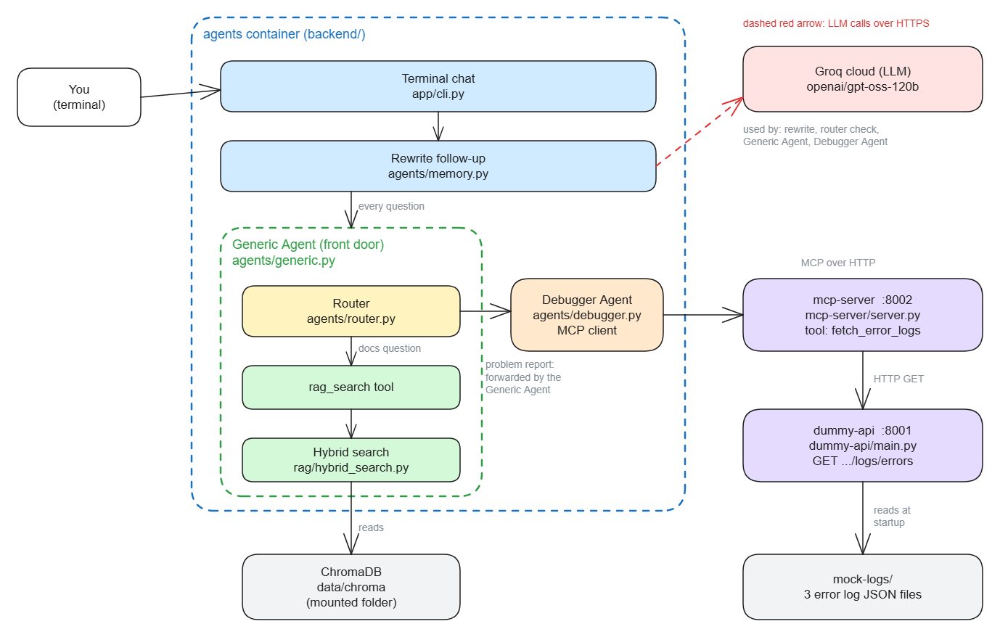
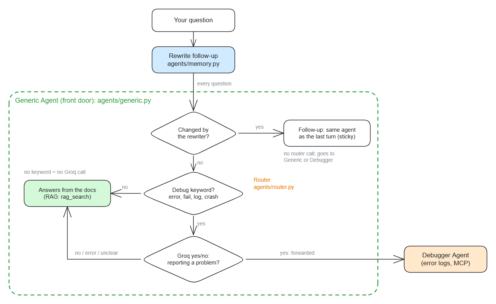
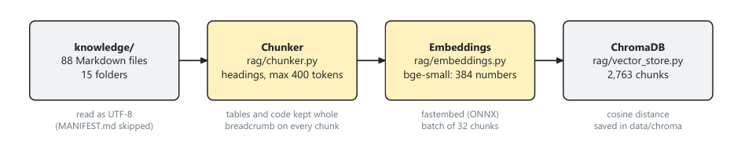
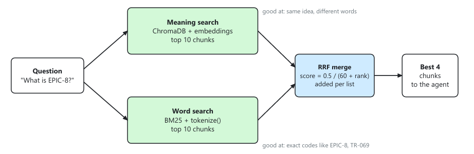
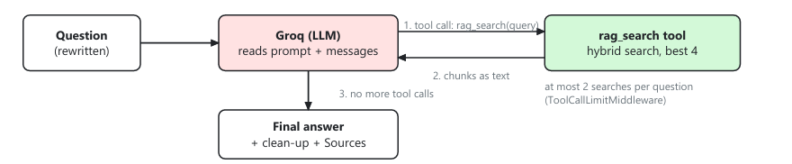

# NetAI Copilot Lite

A two-agent terminal assistant for the Maveric platform: it answers questions from the platform docs and finds the root cause of failures from the error logs.


<!-- Add more badges here, for example:  -->

Maveric users have two kinds of questions: "how does this part of the platform work?" and "why did my job just fail?". The first needs the right page out of 88 docs, the second needs someone to read the error logs. NetAI Copilot Lite answers both from one chat. The **Generic Agent** is the front door for every question: it answers docs questions with RAG (retrieval-augmented generation) over the knowledge base, and forwards problem reports to the **Debugger Agent**, which fetches the error logs through an **MCP** tool and explains what happened, why, and what to do. Everything runs locally in Docker; the only outside service is Groq, the LLM.



*The whole system. Solid arrows are calls inside the system; the dashed red arrow is the only call to the internet (Groq).*

---

## Table of Contents

- [Features](#features)
- [Prerequisites & Installation](#prerequisites--installation)
- [Quick Start / Usage](#quick-start--usage)
- [How It Works](#how-it-works)
- [Configuration / API Reference](#configuration--api-reference)
- [Project Layout](#project-layout)
- [Contributing](#contributing)
- [License](#license)

---

## Features

- **Generic Agent as the front door:** every question goes to it first. It answers docs questions itself and forwards problem reports to the Debugger Agent.
- **Hybrid search over the docs:** meaning search (ChromaDB) plus word search (BM25), merged with Reciprocal Rank Fusion. Finds both "same idea, different words" and exact codes like `EPIC-8`.
- **Debugger Agent over MCP:** fetches error logs through the `fetch_error_logs` MCP tool and answers with *What happened / Why / What to do*. It has no log code of its own.
- **Cheap, careful routing:** a free keyword check first, and a short LLM yes/no check only on a keyword hit. Follow-ups stay with the agent that answered last.
- **No guessing:** if the docs do not cover a question, it says so. A guard in code drops any Debugger answer written without reading the logs.
- **Fails gracefully:** clear messages for missing settings, an empty vector store, a down MCP server, and Groq rate limits.

---

## Prerequisites & Installation

### What you need

| Requirement | Notes |
|---|---|
| **Docker** with Docker Compose | Tested with Docker 29.7 on Windows 11. About 4 GB of memory for Docker is enough. |
| **Groq API key** | Get one at https://console.groq.com/keys (the free tier works). |
| **Python 3.12 or 3.13** | Only for running without Docker. |

The knowledge base (88 Markdown docs in 15 folders) is already in this repo, in `knowledge/`.

### 1. Clone the repo

```bash
git clone https://github.com/mdsamiulhaq03/Copilot-Lite.git
cd Copilot-Lite
```

### 2. Create `.env`

```bash
cp .env.example .env        # Windows PowerShell: copy .env.example .env
```

Open `.env` and set your key:

```dotenv
GROQ_API_KEY=gsk_your_real_key
GROQ_MODEL=openai/gpt-oss-120b
```

`.env` is git-ignored, so the key never goes to GitHub.

### 3. Load the docs into the vector store (ingestion)

```bash
docker compose -f docker-compose.ingest.yml run --rm --build ingest
```

- Reads the 88 docs, splits them into about 2,760 chunks, embeds them with `bge-small-en-v1.5`, and saves them in ChromaDB under `data/chroma/`.
- Runs **without any network** (`network_mode: none`). The embedding model is downloaded while the image is built.
- Takes about 6 minutes. Every run rebuilds the collection from scratch, so it is safe to repeat.

### Running without Docker (for development)

The backend and the MCP server need **separate** virtual environments: `fastmcp` 4 needs `mcp` 2.x, while `langchain-mcp-adapters` needs `mcp` below 2.0. (In Docker each service has its own image, so this does not matter there.)

```powershell
# Backend (from the project root)
python -m venv .venv
.venv\Scripts\python.exe -m pip install -r backend\requirements.txt
.venv\Scripts\python.exe -m pip install -r dummy-api\requirements.txt

# MCP server
python -m venv mcp-server\.venv
mcp-server\.venv\Scripts\python.exe -m pip install -r mcp-server\requirements.txt
```

Then run each one in its own terminal:

```powershell
cd dummy-api;  ..\.venv\Scripts\python.exe -m uvicorn main:app --port 8001
cd mcp-server; .\.venv\Scripts\python.exe server.py
cd backend;    ..\.venv\Scripts\python.exe -m scripts.ingest     # once
cd backend;    ..\.venv\Scripts\python.exe -m app.cli
```

---

## Quick Start / Usage

Start the services, then open the chat:

```bash
docker compose up -d --build          # start the Dummy API and the MCP server
docker compose run --rm agents        # open the chat
```

The chat waits until both services are healthy. Type `clear` to forget the chat so far, `exit` to quit. When you are done:

```bash
docker compose down
```

### Example session

```text
You: What is EPIC-8?

Copilot (Generic Agent): EPIC-8 is the part of the plan that adds the Copilot MCP layers ...

Sources: rearchitecture/epics/EPIC-8-copilot-mcp-layers.md

You: The BDT worker keeps crashing

Copilot (Debugger Agent): What happened: the BDT worker stopped while starting up.
Why: the Kafka setting KAFKA_MAX_POLL_INTERVAL_MS is written as 1.44e+07, which the worker cannot read as a whole number.
What to do:
- Set KAFKA_MAX_POLL_INTERVAL_MS to 14400000.
- Restart the BDT worker.

You: How do I fix it?
(understood as: How do I fix the BDT worker crash?)
```

*(Answers are shortened here; the exact wording comes from the LLM.)*

### Things to try

| Type | What happens |
|---|---|
| `What is EPIC-8?` | Generic Agent: a short, plain answer from the docs, with a Sources line |
| `How does the BDT Engine work?` | Generic Agent |
| `Who won the 2022 World Cup?` | "The documentation does not cover this." |
| `The BDT worker keeps crashing` | Debugger Agent: root cause from the logs (a Kafka setting written as `1.44e+07`) and what to do |
| then `How do I fix it?` | A follow-up: stays with the Debugger Agent |
| `My training job failed, something about a CSV` | Debugger Agent: the CSV file is missing from S3 |
| `Why did my BDT inference run time out?` | Debugger Agent: no free worker picked up the job |

On the free Groq tier (8,000 tokens per minute), wait about a minute after a docs question. The free tier also allows 200,000 tokens per day; after that the chat says how long to wait.

### Test scripts

```bash
# from backend/
python -m scripts.search "What is EPIC-8?"        # hybrid search only, no LLM
python -m scripts.route --samples                 # which agent each sample goes to
python -m scripts.debug "The worker crashed"      # one Debugger Agent answer

# from mcp-server/
python try_client.py                              # call fetch_error_logs directly
```

---

## How It Works

### Routing



Every question goes to the **Generic Agent** first: it is the front door, and it decides who answers. It answers docs questions itself and forwards problem reports to the Debugger Agent.

1. **Rewrite:** a follow-up ("how many stories does it have?") is rewritten into a full question using the last 2 turns. Only a message with a pointing word (it, its, this, that, these, those, they, them, their, one) is sent to the rewriter; any other message is kept exactly as typed.
2. **Sticky routing:** if the question was rewritten, it is a follow-up, so it goes to the agent that answered last.
3. **Router** (new questions, used by the Generic Agent): a keyword check (`error`, `fail`, `log`, `crash`). Only on a keyword hit, a short Groq yes/no check: "is the user reporting a problem?". So "What does the error handling module do?" stays with the Generic Agent.

### Ingestion



- **Chunking:** split at `##` / `###` headings, at most about 400 tokens per chunk, tables and code blocks kept whole, and a breadcrumb `[folder/file.md > H1 > H2]` at the start of every chunk.
- **Embeddings:** each chunk becomes 384 numbers with `bge-small-en-v1.5`, run locally through fastembed.
- **Storage:** ChromaDB saves the chunks in `data/chroma/` and compares them by cosine distance.

### Hybrid search



- **Meaning search:** ChromaDB, top 10. Good at the same idea in different words.
- **Word search:** BM25, top 10. Good at exact codes like `EPIC-8` or `TR-069`.
- **Merge:** Reciprocal Rank Fusion combines the two lists; the best 4 chunks go to the agent.

### Generic Agent (RAG)



- Groq reads the question and calls `rag_search`, at most 2 times per question.
- **Answers** only from the found chunks, in plain words. Sources are added by the code from the files the search returned.

### Debugger Agent (MCP)

- Connects to the MCP server as an **MCP client** and gets the `fetch_error_logs` tool from it (MCP discovery). The backend has no log-fetching code and no log data.
- Has **no RAG**: only the logs plus the LLM's general knowledge.
- Answers with **What happened / Why / What to do**.

### MCP server and Dummy API

- `mcp-server/`: a `fastmcp` server with one tool, `fetch_error_logs(tenant_id)`, over Streamable HTTP. It calls the Dummy API.
- `dummy-api/`: a FastAPI service with one endpoint that returns the 3 logs in `mock-logs/` as a JSON array.
- `mock-logs/`: 3 realistic Maveric failures (BDT Engine timeout, missing training CSV, BDT worker crash), in the platform's real error log format.

### When something fails

| Case | What happens |
|---|---|
| Missing `GROQ_API_KEY` or `GROQ_MODEL` | The chat stops at startup and says what to set |
| ChromaDB is empty | The chat stops at startup and shows the ingestion command |
| No logs in `mock-logs/` | The Dummy API refuses to start |
| Docs do not cover the question | "The documentation does not cover this." No guessing |
| MCP server or Dummy API down | "I could not fetch the error logs right now." Docs questions keep working |
| Debugger answers without reading the logs | The answer is dropped and the user is asked to describe the problem again |
| Groq rate limit or timeout | 3 retries with waits, then a friendly message |
| Router or rewrite fails | Falls back to the Generic Agent / the original question |

---

## Configuration / API Reference

### Settings (`.env`)

| Variable | Type | Default | Description |
|---|---|---|---|
| `GROQ_API_KEY` | string | none (required) | Groq API key |
| `GROQ_MODEL` | string | none (required) | Groq model, e.g. `openai/gpt-oss-120b` |


The MCP server reads `DUMMY_API_URL` (default `http://localhost:8001`) and `MCP_PORT` (default `8002`). The Dummy API reads `LOGS_DIR` (default `mock-logs/`).

### Services and ports

| Service | Port | Address inside Docker | Try it |
|---|---|---|---|
| dummy-api | 8001 | `http://dummy-api:8001` | http://localhost:8001/docs |
| mcp-server | 8002 | `http://mcp-server:8002/mcp` | MCP Inspector: `npx @modelcontextprotocol/inspector`, choose "Streamable HTTP", enter the address |

### MCP tool

| Tool | Argument | Returns |
|---|---|---|
| `fetch_error_logs` | `tenant_id` (string; letters, digits, `-`, `_`; up to 64 characters) | The tenant's error logs as JSON text, or a message starting with `ERROR:` if the logs could not be fetched |

### Dummy Error Log API

```http
GET /v1/tenants/{tenant_id}/baselines/logs/errors
GET /health
```

```bash
curl http://localhost:8001/v1/tenants/demo-tenant/baselines/logs/errors
```

---

## Project Layout

```text
backend/                     ingestion + RAG + agents (one image)
  app/core/                  settings, Groq model
  app/rag/                   chunker, embeddings, ChromaDB, hybrid search, rag_search tool
  app/agents/                generic, debugger, router, memory
  app/cli.py                 the terminal chat
  scripts/                   ingest, plus test scripts: search, route, debug
dummy-api/                   Dummy Error Log API (FastAPI)
mcp-server/                  MCP server with fetch_error_logs (fastmcp)
mock-logs/                   the 3 error logs
knowledge/                   the 88 docs the Generic Agent answers from
data/chroma/                 the vector store (not in git: made by ingestion)
images/                      the diagrams in this README
docker-compose.yml           dummy-api, mcp-server, agents
docker-compose.ingest.yml    one-off ingestion job
.env.example                 settings to copy into .env
```

---


