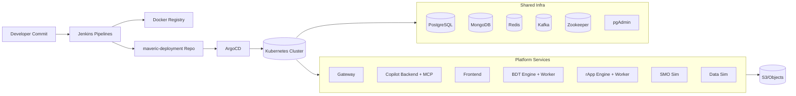

# High-Level Deployment Design (HLD)

## Objective
Provide a production-grade and staging-capable deployment architecture for CloudlyNet services using:
- Jenkins for image build/publish and version updates.
- Helm charts under ArgoCD for Kubernetes deployment.
- AWS-integrated runtime services (S3, ALB/Ingress).

## High-Level Architecture

## Core Boundaries
- Deployment control plane: Jenkins + ArgoCD + Git repository.
- Runtime plane: Kubernetes workloads for services and infra.
- External edge: Ingress/ALB/NGINX to gateway/frontend/public services.
- Data plane: PostgreSQL, MongoDB, Redis, Kafka, object storage.
- Copilot release packaging: one chart and one pipeline move backend + MCP together.

## Environment Strategy
- Staging and production-track charts are both maintained under `argocd/`.
- Environment identity is inferred from chart path, hostnames, namespaces, and image repository patterns.
- Due to drift in naming conventions, mapping rules are documented separately in `Naming_and_Environment_Mapping.md`.

## Design Principles
- GitOps-first runtime config via Helm charts.
- Immutable image tags promoted by CI.
- Secret/env injection at deployment layer.
- Service isolation by chart and namespace conventions.
- Multi-workload packaging is allowed when version lockstep is operationally required (copilot backend + MCP server).
- Copilot database ownership is intentionally split by concern:
  - postgres chart bootstraps roles/databases/extensions
  - copilot chart applies schema, tenant migration, grants, and RLS
- Copilot GitOps rollout now also includes chart-packaged knowledge-base bootstrap between schema migration and runtime pod rollout.
- Platform schema changes that must reconcile existing live databases should be packaged as idempotent postgres-chart hook jobs instead of relying on first-boot `initdb`; current examples: `006_nybsys_ingestion.sql`, `008_nybsys_rng_seed.sql`, `009_nybsys_nanolink.sql`, and `007_trial_org.sql` in both postgres chart tracks. The `009` hook is explicitly a reconciler for partially-created NanoLink tables, including missing defaults such as `edge_devices.status DEFAULT 'pending'`.
- Gateway application charts now wait on Postgres readiness before starting the main container, and pgAdmin charts now import the platform Postgres server definition declaratively at launch.
- Kafka/ZooKeeper persistence is now split by environment: production reuses the shared `efs-pvc` claim already used by rApp/BDT, while staging continues to use chart-managed PVCs.
- When `persistence.existingClaim` is used, init containers now create and `chmod 0777` the shared `kafka`, `zookeeper/data`, and `zookeeper/log` subpaths before the Confluent `uid=1000` containers start.
- Worker timeout defaults are now stored as quoted decimal strings in values so Helm cannot emit scientific notation that the current BDT/rApp worker images fail to parse.
- Current rollout baseline keeps `maveric.rapp.train.v1=2`, `maveric.bdt.train.v1=2`, and the rApp worker chart at `replicaCount=2`.
- Documentation-first handling of known inconsistencies without file rename.

## Staging Drift Control (2026-02-24)
- Staging CI pipelines now update staging chart values in this repo (`argocd/staging-maveric_*`) for gateway, bdt-engine, data-sim, rapp, and smo-sim.
- `bdt_worker` is intentionally deployed from the same image stream as `bdt_engine`.
- This closes a primary drift vector where staging builds could complete without manifest tag promotion.
- A dedicated staging SMO chart path now exists at `argocd/staging-maveric_platform_smo_sim`.
- Staging gateway secret now uses Cognito/runtime key parity with production-track templates, while preserving staging namespace service URLs for DB/cache/internal APIs.
- Staging rApp chart now follows production-track chart structure (worker and PDB templates included) with staging exception `efs.enabled: false` to avoid shared-volume dependency.

## Env Source-of-Truth Model (2026-02-27)
- Staging runtime env is now controlled at Helm layer:
  - chart secrets are generated from staging chart `values.yaml` (`secretData` maps),
  - workloads read env from those runtime secrets (`envFrom`) and optional explicit `env` overrides.
- Staging app secrets are now isolated per chart for frontend, bdt-engine, bdt-worker, rapp, data-sim, and smo-sim; the previous shared `maveric-aws` secret model is no longer valid for the expanded runtime env surface.
- Staging CI now builds images without `.env` file injection or docker build-time env propagation.
- Frontend runtime env handling in deployment Dockerfile context is startup-time placeholder replacement, so auth/API values can be changed at deploy time instead of image-build time.
- Staging frontend auth keys (`NEXT_PUBLIC_API_BASEURL`, `NEXT_PUBLIC_COGNITO_*`) are supplied from Helm values and validated at container start to prevent silent auth misconfiguration.
- Staging gateway ingress was aligned to ALB shared-ingress routing and now carries explicit CORS/runtime parity keys (`CORS_ALLOW_ORIGINS`, `DEV_TENANT_ROLE`, `COPILOT_*`) via Helm `secretData`.

## Production Env Source-of-Truth Model (2026-03-06)
- The production track now follows the same runtime env control approach as staging:
  - Helm values (`secretData`) define runtime secret payloads.
  - Workloads consume runtime env via `envFrom` plus optional `env`/extra secret overlays.
- Production app/runtime secret isolation is now per chart, not a single namespace-shared application secret.
- Production Jenkins service pipelines now build without active runtime `.env` injection, preserving deploy-time configuration ownership in Helm/Kubernetes.
- Gateway production ingress intentionally remains on the live `nginx` controller; staging ALB settings are not applied directly to production.
- Production gateway runtime parity keys (`DEV_TENANT_ROLE`, `CORS_ALLOW_ORIGINS`, `COPILOT_*`) are now values-driven.
- Production frontend runtime key model now uses values-driven Cognito/API/S3 keys (`NEXT_PUBLIC_COGNITO_*`, `NEXT_PUBLIC_API_BASEURL`, `NEXT_PUBLIC_S3_*`).
