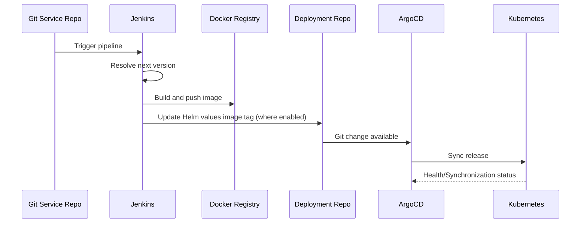

# Low-Level Deployment Design (LLD)

## Chart Structure
Each chart generally follows:
- `Chart.yaml`
- `values.yaml`
- `templates/deployment.yaml`
- `templates/service.yaml`
- optional: `templates/secret.yaml`, `templates/ingress.yaml`, `templates/hpa.yaml`, worker templates

Main chart groups:
- Application charts: gateway, frontend, bdt-engine, bdt-worker, data-sim, rapp, smo-sim
- Unified application charts: copilot (backend + MCP server)
- Infrastructure charts: postgres, mongodb, redis, kafka, zookeeper, pgadmin

## Dockerfile Usage Map (Deployment Context)
- `Dockerfiles/gateway.Dockerfile` -> Gateway
- `Dockerfiles/frontend.Dockerfile` -> Frontend
- `Dockerfiles/smo.Dockerfile` -> SMO Sim
- `Dockerfiles/datasim.Dockerfile` -> Data Sim
- `Dockerfiles/bdt.Dockerfile` -> BDT Engine and BDT Worker
- `Dockerfiles/rapp.Dockerfile` -> rApp Engine and rApp Worker
- Copilot backend -> `submodule/cloudlynet_ai_copilot/backend/Dockerfile` (built from the service repo, not `Dockerfiles/`)
- Copilot MCP server -> `submodule/cloudlynet_ai_copilot/backend/app/mcp_server/Dockerfile` with build context `submodule/cloudlynet_ai_copilot/backend`

## Runtime Configuration Pattern
Most app services use one of these patterns:
- `envFrom.secretRef` for full secret injection (`maveric-aws`, `maveric-aws-gateway`)
- optional explicit `env` overlays for selected keys (staging + production app charts)
- static env in template for infrastructure services (Kafka, pgAdmin, PostgreSQL)

Production follow-up:
- app charts now use distinct secret objects per chart in the live namespace (`maveric-aws-frontend`, `maveric-aws-bdt-engine`, `maveric-aws-bdt-worker`, `maveric-aws-data-sim`, `maveric-aws-rapp`, `maveric-aws-smo-sim`, `maveric-aws-gateway`).
- staging now follows the same per-chart secret-object pattern for frontend, bdt-engine, bdt-worker, rapp, data-sim, and smo-sim, preventing `Secret/maveric-aws` overwrite races between independently synced apps.

## CI/CD Flow Details

## Jenkins Implementation Notes
- Pipelines exist in pairs (`jenkins/maveric_*.groovy` and `jenkins/staging_*.groovy`).
- Some staging pipelines update staging chart paths; others have deployment-repo update stages commented out.
- Image naming patterns vary (`maveric-platform-*-staging`, `staging-maveric-*`, underscore/hyphen variants).
- Copilot currently has a production-only pipeline (`jenkins/maveric_platform_copilot.groovy`) because the request scope is production deployment design first.

## Key Infrastructure Details
- PostgreSQL and MongoDB rely on existing claims and/or explicit secrets.
- BDT and rApp charts include EFS configuration (`efs.enabled`, `claimName: efs-pvc`).
- Kafka uses static broker env and Zookeeper host from values.
- Copilot production chart now includes a SQL migration pack (`files/01-copilot-tenant-upgrade.sql`, `files/02-copilot-schema.sql`, `files/03-copilot-rls.sql`) rendered through a ConfigMap and executed by the migration hook job before backend/MCP deployments.
- Copilot production chart now also includes a packaged `files/knowledge_base.tgz` archive rendered through `templates/knowledge-base-configmap.yaml` and a `templates/knowledge-base-job.yaml` hook that replays the local RAG bootstrap scripts before backend/MCP Deployments sync.
- The postgres chart keeps a separate bootstrap hook for copilot roles/databases/extensions and no longer owns the copilot table/schema rollout.
- Gateway chart tracks now prepend a `wait-for-postgres` init container that reads `POSTGRES_DSN` from the existing gateway secret and blocks container startup on `pg_isready`.
- pgAdmin chart tracks now render a `*-servers` ConfigMap, mount `/pgadmin4/servers.json`, set `PGADMIN_REPLACE_SERVERS_ON_STARTUP=True` so the shared Postgres server entry is declarative, and gate liveness/readiness behind a `startupProbe` because the current container image may take ~38 seconds before the first successful HTTP response.
- Both postgres charts now also ship platform delta migration files:
  - `files/006_nybsys_ingestion.sql`
  - `files/008_nybsys_rng_seed.sql`
  - `files/009_nybsys_nanolink.sql`
  - `files/007_trial_org.sql`
- Each chart renders dedicated ConfigMap plus ArgoCD `Sync` hook Job pairs for:
  - `*-nybsys-migration`
  - `*-trial-migration`
- The platform delta hooks are reconciler steps for existing clusters, not full bootstrap replacements. `006_nybsys_ingestion.sql` assumes the base schema and helper function `set_updated_at()` already exist; `008_nybsys_rng_seed.sql` assumes `nybsys_uploads` exists from `006`; `009_nybsys_nanolink.sql` assumes `set_updated_at()` and `pgcrypto` are available and repairs missing defaults/NOT NULL posture on existing NanoLink tables; `007_trial_org.sql` assumes base platform tables such as `tenants` and `tenant_memberships` already exist.
- Kafka/ZooKeeper persistence now supports `persistence.existingClaim`: production defaults to the shared `efs-pvc` claim already used by rApp/BDT and mounts isolated `kafka`, `zookeeper/data`, and `zookeeper/log` subpaths, while staging still renders dedicated PVCs.
- Shared-claim mode now includes init-container permission bootstrap so those directories are writable before Confluent's `uid=1000` containers run their startup checks.
- Worker timeout defaults now remain quoted strings in values so the rendered `KAFKA_MAX_POLL_INTERVAL_MS`, `KAFKA_SESSION_TIMEOUT_MS`, and `KAFKA_HEARTBEAT_INTERVAL_MS` env vars stay parseable by the current worker images.
- Current rollout defaults are values-driven: `maveric.rapp.train.v1=2`, `maveric.bdt.train.v1=2`, and `worker.replicaCount=2` for the rApp chart.

## Drift and Consistency Risks
- Mixed naming conventions across charts, namespaces, and images.
- Chart metadata comments/descriptions are copied between services in some files.
- Rendered artifacts may lag current values/templates.
- Image repository naming still mixes production-track intent with `-staging` suffixes.

These are documented, not renamed, per repository constraints.

## Staging CI Tag Update Implementation (2026-02-24)
- Enabled/added `Image Version Upgrade` stages in:
  - `jenkins/staging_maveric_platform_gateway.groovy`
  - `jenkins/staging_maveric_platform_bdt_engine.groovy`
  - `jenkins/staging_maveric_platform_data_sim.groovy`
  - `jenkins/staging_maveric_platform_rapp.groovy`
  - `jenkins/staging_maveric_platform_smo_sim.groovy`
- Each stage updates only staging chart paths:
  - `argocd/staging-maveric_platform_*/values.yaml`
- `bdt_worker` intentionally uses the same image stream as `bdt_engine`; no separate worker manifest tag stage is required by current deployment design.

## Remaining LLD Gaps
- Directory naming constraint remains: `argocd/staging-maveric_platform_postgres ` includes a trailing space and requires careful shell/path handling.
- Production-track naming drift is now reduced for env management and namespace pins, but image-repository naming remains inconsistent by design.
- Staging copilot onboarding is still pending; only `argocd/maveric_platform_copilot` exists today.

## Staging Parity Update (2026-02-24)
- `argocd/staging-maveric_platform_gateway`:
  - deployment template now includes `terminationGracePeriodSeconds` parity.
  - secret key set now aligns with production runtime/auth keys (Cognito) while targeting staging infra URLs.
  - `poddisruptionbudget.yaml` added with nil-safe guard.
- `argocd/staging-maveric_platform_rapp`:
  - chart metadata/helpers/templates aligned to production-track structure.
  - templates added: `rapp-worker.yaml`, `efs.yaml`, `poddisruptionbudget.yaml`, `templates/tests/test-connection.yaml`.
  - staging exception implemented for shared storage: all EFS resources/mounts are conditional and disabled via `efs.enabled: false`.

## Staging Env SoT Implementation (2026-02-27)
- Jenkins staging pipelines:
  - removed runtime `.env` copy/build-arg injection from all staging service pipelines.
  - docker builds now produce environment-agnostic images; runtime env is provided by Kubernetes/Helm.
- Helm staging charts:
  - `templates/secret.yaml` now renders secret payload from `values.yaml` (`secretData`).
  - app deployments now accept:
    - `additionalEnvFromSecrets` (extra `envFrom.secretRef` entries)
    - `env` (explicit env vars, allowing runtime override precedence)
  - worker templates support worker-specific env overlays:
    - BDT worker: `bdtWorker.env`, `bdtWorker.additionalEnvFromSecrets`
    - rApp worker: `workerEnv`, `workerAdditionalEnvFromSecrets`
- Frontend Dockerfile reference:
  - removed `.env` copy during build.
  - added runtime placeholder replacement entrypoint for `NEXT_PUBLIC_*` envs.
  - startup now fails fast when required auth/runtime keys are missing (`NEXT_PUBLIC_API_BASEURL`, `NEXT_PUBLIC_COGNITO_*`).
- Staging frontend values-driven auth wiring:
  - `argocd/staging-maveric_platform_frontend/values.yaml` now carries runtime keys for `NEXT_PUBLIC_API_BASEURL`, `NEXT_PUBLIC_COGNITO_*`, `NEXT_PUBLIC_S3_*`, and `COGNITO_CLIENT_SECRET` via `secretData`.
- Staging gateway routing/env parity:
  - `argocd/staging-maveric_platform_gateway/values.yaml` ingress is now ALB-shared (`className: alb` + ALB annotations) for public host routing consistency.
  - staging gateway `secretData` now includes `DEV_TENANT_ROLE`, `CORS_ALLOW_ORIGINS`, `COPILOT_BASE_URL`, and `COPILOT_BACKEND_API`.
- Gateway DSN hardening:
  - staging `POSTGRES_DSN` now uses URI-safe password encoding for `@`.

## Production Env SoT Implementation (2026-03-06)
- Jenkins production pipelines:
  - removed active runtime `.env` copy/build-arg injection from all production service pipelines (`jenkins/maveric_*.groovy`).
  - production images are now built environment-agnostic, with runtime env owned by Helm/Kubernetes.
- Helm production charts:
  - production app `templates/secret.yaml` now render payload from `values.yaml` (`secretData`).
  - production deployments/workers now accept:
    - `additionalEnvFromSecrets`
    - `env`
    - worker overlays where applicable (`bdtWorker.env`, `workerEnv`, etc.).
- Gateway production parity:
  - ingress is now ALB-shared (`className: alb` + ALB annotations).
  - gateway values-driven secret data now includes `DEV_TENANT_ROLE`, `CORS_ALLOW_ORIGINS`, `COPILOT_*`.
  - `POSTGRES_DSN` is URI-safe encoded for `@` in password.
- Frontend production parity:
  - production `secretData` now carries runtime Cognito/API/S3 keys (`NEXT_PUBLIC_COGNITO_*`, `NEXT_PUBLIC_API_BASEURL`, `NEXT_PUBLIC_S3_*`).
- Namespace normalization:
  - production hardcoded `namespace: staging` references were replaced with `{{ .Release.Namespace }}` for namespaced resources.
  - cluster-scoped PV template was cleaned by removing the stale namespace field.
